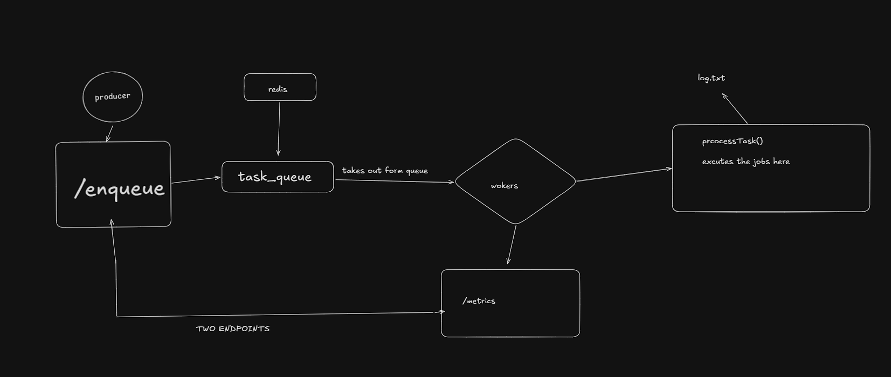

# 📦 BackgroundQueue

A lightweight **background job queue** built with **Node.js**, **TypeScript**, **Redis**, and **Express**. It uses a producer-consumer pattern to enqueue and process tasks asynchronously.



---

## ✨ Features

- **Redis-backed queue** — reliable task storage with `ioredis`
- **Concurrent workers** — configurable worker concurrency (default: 3)
- **Multiple task types** — supports `email`, `image`, and `data` tasks
- **Metrics endpoint** — real-time worker stats via `/metrics`
- **File logging** — task results are appended to `logs.txt`

---

## 🏗️ Architecture

| Component | File | Description |
|-----------|------|-------------|
| **Producer** | `src/producer.ts` | Express API (`:3000`) — accepts tasks via `POST /enqueue` |
| **Worker** | `src/worker.ts` | Polls Redis queue, dispatches tasks to processor |
| **Processor** | `src/processor.ts` | Executes task logic based on task type |
| **Redis** | `src/redis.ts` | Shared Redis client configuration |
| **Types** | `src/types.ts` | TypeScript interfaces (`Task`, `Metrics`, `TaskType`) |
| **Logger** | `src/logger.ts` | Appends timestamped logs to `logs.txt` |

---

## 🚀 Getting Started

### Prerequisites

- **Node.js** ≥ 18
- **Redis** server running on `127.0.0.1:6379`

### Installation

```bash
git clone https://github.com/Monikanto/BackgroundQueue.git
cd BackgroundQueue
npm install
```

### Running

Start the **producer** (API server on port 3000):

```bash
npx ts-node-dev src/producer.ts
```

Start the **worker** (metrics on port 4000):

```bash
npx ts-node-dev src/worker.ts
```

---

## 📡 API

### `POST /enqueue` — Add a task

```bash
curl -X POST http://localhost:3000/enqueue \
  -H "Content-Type: application/json" \
  -d '{"type": "email", "payload": {"to": "user@example.com"}}'
```

**Response:**

```json
{
  "message": "Task added",
  "taskId": "a1b2c3d4-..."
}
```

### `GET /metrics` — Worker stats

```bash
curl http://localhost:4000/metrics
```

**Response:**

```json
{
  "processed": 12,
  "failed": 1,
  "pending": 3
}
```

---

## 📁 Project Structure

```
backgroundQueue/
├── src/
│   ├── producer.ts      # Express API — enqueues tasks
│   ├── worker.ts        # Polls queue & runs workers
│   ├── processor.ts     # Task execution logic
│   ├── redis.ts         # Redis client setup
│   ├── types.ts         # TypeScript type definitions
│   └── logger.ts        # File-based logger
├── package.json
├── tsconfig.json
└── README.md
```

---

## 🛠️ Tech Stack

- **Runtime:** Node.js + TypeScript
- **Queue:** Redis (via `ioredis`)
- **HTTP:** Express 5
- **UUID:** `uuid` v13

---

## 📄 License

ISC
